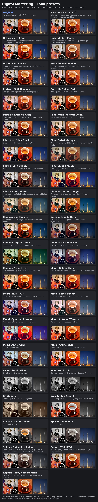

# Digital Mastering Suite

Post-processing grade applied to every generated image, after the inpaint
composite. Works on Forge, reForge and Forge Classic (Neo). 36 look presets,
each with a one-line description.



## Layout

```
[x] Digital Mastering
    Look preset [..........v]  [Reset]
    one-line description of the preset
    [▦ Preset reference]           <- click to unfold the picture above
    Intensity  ------o---          <- how much of the whole grade, 0 = original
    > Quick start                  <- (closed)
    [ Color | Detail & Finish | Effects | Repair & Tools ]
      > Guide                      <- guide for this tab (closed)
      Section title
        [x] Enable ...
        every control, nothing hidden
```

| Tab | Sections |
|---|---|
| Color | Enable Color · Light (exposure, contrast) · White balance · Colour (saturation, vibrance) · Split toning · CDL |
| Detail & Finish | Enable Detail & Finish · Detail (clarity, clarity radius, sharpen) · Finish (vignette, grain, grain size, anti-banding) |
| Effects | Selective colour · LUT (picker + Refresh, opacity, extra folder) |
| Repair & Tools | Restoration · Protect people · Exposure check |

Each section has an **Enable** box (Color, Detail & Finish, Selective Color,
LUT, Restoration); an unticked section is ignored whatever its sliders say.
A preset ticks the sections it uses (their other controls at neutral) and
unticks the rest; it never touches Intensity or the LUT, so you can set
Intensity once and flick through presets. The colour sliders show a colour
wheel on their track.

**Preset reference** unfolds a picture of every preset on three sample photos
(portrait, still life, night scene). Scroll inside the box, or click the
picture to open it full size in a new tab. Click the button again to fold it.

## Order

restoration -> exposure/WB (linear light) -> CDL -> contrast -> saturation ->
split toning -> LUT -> selective colour -> clarity -> sharpen -> vignette ->
grain -> dither. Dither runs last so that no later step amplifies it.

## PNG info

One entry, only the non-default values:

    Digital Mastering: "temperature=0.35; contrast=0.1; highlight_tint=0.4"

Send-to / paste restores all of it. The older `Restore(...) | CDL(...)` format
still pastes.

## Notes

- Exposure and white balance work in linear light. Clarity and sharpen work on
  luminance only, so they cannot fringe colour edges; clarity is weighted to
  the midtones so it does not halo clipped areas.
- Grain and dither are seeded from the image's seed: the same seed gives the
  same grain.
- **Protect people** uses SegFormer-B0 (about 15 MB, downloaded on first use).
  The model is parked on the CPU between jobs.
- LUTs: put `.cube` files in `models/LUTs`, or name another folder. LUTs with a
  non-0..1 `DOMAIN_MIN/MAX` are refused with a message; a missing LUT is
  skipped and the rest of the grade still applies.

## Files

```
scripts/digital_mastering.py   UI + host hooks, built from the control table
lib_dm/controls.py             every control, declared once (UI, presets, PNG info)
lib_dm/presets.py              the 36 looks, each listing only what it changes
lib_dm/layout.py               tabs, sections and guide texts
lib_dm/pipeline.py             the chain, in order, skipping inactive stages
lib_dm/ops.py                  the image operations, pure torch
lib_dm/lut.py                  .cube discovery and parsing
lib_dm/segment.py              SegFormer-B0 person mask
lib_dm/reference.py            the folded preset reference
preset_reference.jpg           the preset reference picture
style.css                      colour-wheel sliders, section titles, reference box
```

## Credits

Sample photos in `preset_reference.jpg`, from scikit-image's sample data:
Eileen Collins by NASA (public domain), coffee cup by Rachel Michetti (CC0),
Falcon 9 launch by SpaceX (public domain).

Thanks also to **Claude**, Anthropic's AI assistant, for help building this
extension.

## License

MIT, see `LICENSE`.
